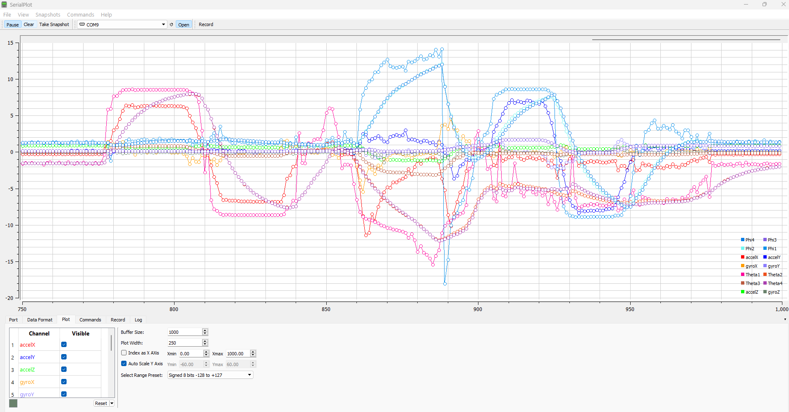

# Adafruit MPU6050 on Raspberry Pi Pico

This project demonstrates how to use the **Adafruit MPU6050 6-DoF Accelerometer and Gyroscope** with the **Raspberry Pi Pico** using the **Arduino IDE**. The MPU-6050 is a 6-axis motion tracking device, combining a 3-axis Gyroscope and a 3-axis Accelerometer.

An **accelerometer** measures proper acceleration. For example, when an accelerometer is at rest on the Earth's surface, it measures the acceleration due to gravity, which is approximately **9.81 m/s²** upwards (by definition).

## Getting Started
### Step 1: Install the Arduino IDE
- Download and install the **Arduino IDE**.
- Open the Arduino IDE and go to **File -> Preferences**.
In the **Additional Boards Manager URLs** field, add the following URL:
```
https://github.com/earlephilhower/arduino-pico/releases/download/global/package_rp2040_index.json
```

### Step 2: Install the Raspberry Pi Pico/RP2040 Board
- Go to **Tools -> Board -> Boards Manager...**.
- Search for **Raspberry Pi Pico/RP2040** and install the package by **Earle F. Philhower**.

### Step 3: Select the Board and Port
- Go to **Tools -> Board** and select **Raspberry Pi Pico** (or **Raspberry Pi Pico W** if you have the wireless version).
- Go to **Tools -> Port** and select the active COM port corresponding to your Raspberry Pi Pico.

### Step 4: Wiring the MPU6050 to the Raspberry Pi Pico
- Connect the **MPU6050** to the **Raspberry Pi Pico** as follows:
**MPU6050 VCC** to **Pico 3.3V**
**MPU6050 GND** to **Pico GND**
**MPU6050 SDA** to **Pico GP4**
**MPU6050 SCL** to **Pico GP5**
For detailed wiring, you can refer to the image below:


## Serial Monitor.


## Credits
Special thanks to Paul McWhorter for his excellent tutorial on this project:
Watch the tutorial on YouTube (https://www.youtube.com/watch?v=2AO_Gmh5K3Q&list=PLGs0VKk2DiYwEo-k0mjIkWXlkrJWAU4L9)

## About
Written by David Gofman.
MIT License – All text above must be included in any redistribution.

